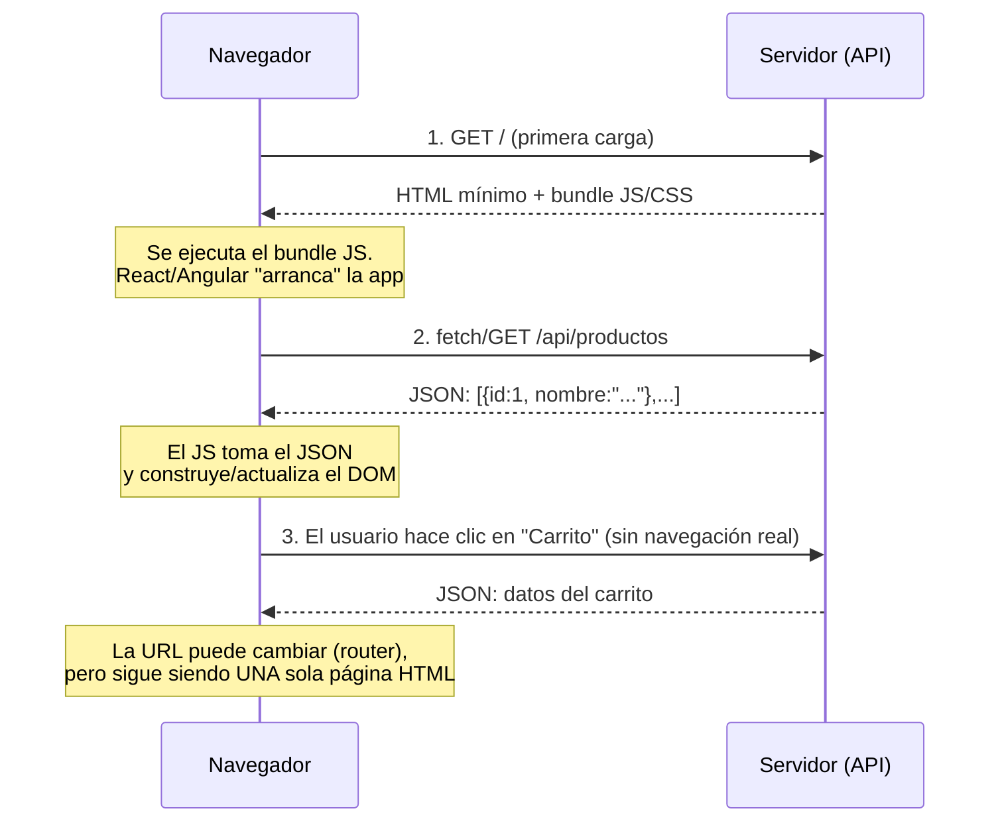
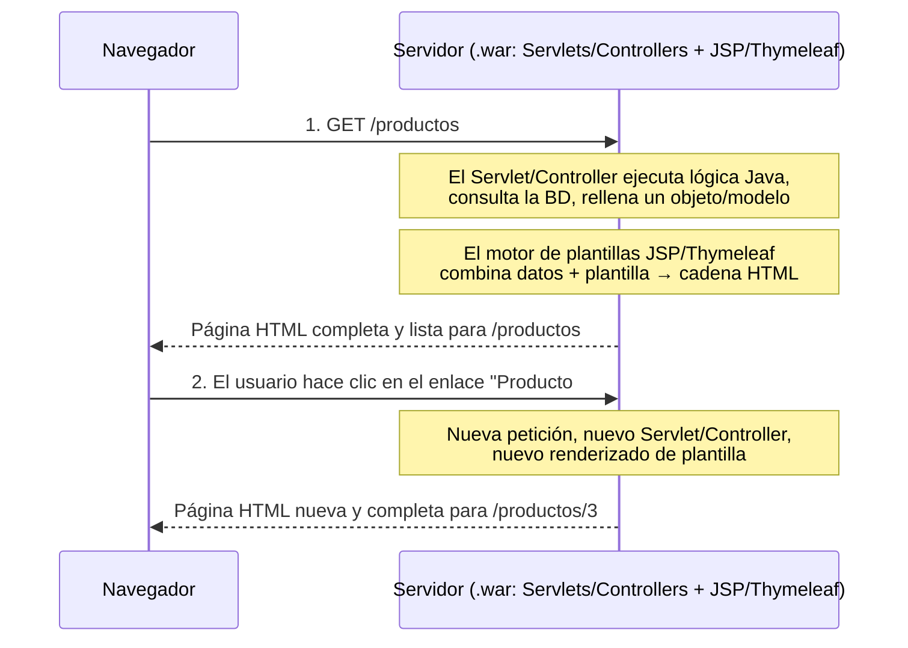

--- 
# Archivo: api-stream.md (Ruta: .)
---

# API Stream

El API Stream de Java (introducido en Java 8) es una forma moderna y funcional de trabajar con colecciones de datos (listas, conjuntos, etc.) de manera más declarativa y limpia.

En lugar de decir **“cómo hacerlo”** (bucles for), decimos **“qué queremos hacer”** sobre los datos.

- Código más limpio y fácil de leer
- Evita bucles anidados
- Facilita operaciones sobre datos (filtrar, transformar, agrupar)
- Permite paralelizar (con .parallelStream())


---
## Con qué clases se usa?

Principalmente con colecciones **Set y List** pero también podemos usarlo con **Map**


El API Stream también se usa con **Java NIO**, de hecho, NIO.2 (desde Java 8) incorpora métodos que devuelven Streams, lo cual permite procesar archivos y directorios de forma funcional, igual que con colecciones.

| Fuente del Stream      | Método NIO                           | Tipo de Stream devuelto |
| ---------------------- | ------------------------------------ | ----------------------- |
| Directorio             | `Files.list(Path)`                   | `Stream<Path>`          |
| Directorios recursivos | `Files.walk(Path)`                   | `Stream<Path>`          |
| Líneas de texto        | `Files.lines(Path)`                  | `Stream<String>`        |
| Archivo grande         | `Files.find(Path, int, BiPredicate)` | `Stream<Path>`          |


### ¿De dónde vienen los Streams?

| Fuente                         | Ejemplo                                 | Tipo de Stream   |
| ------------------------------ | --------------------------------------- | ---------------- |
| Colecciones                    | `lista.stream()`                        | `Stream<T>`      |
| Arrays                         | `Arrays.stream(array)`                  | `Stream<T>`      |
| Generadores                    | `Stream.of(...)`, `Stream.iterate(...)` | `Stream<T>`      |
| **Java NIO (ficheros)**        | `Files.list(Path)`                      | `Stream<Path>`   |
| **Java NIO (líneas de texto)** | `Files.lines(Path)`                     | `Stream<String>` |


---
## Conceptos básicos

| Concepto                    | Qué hace                                            | Ejemplo simple                             |
| --------------------------- | --------------------------------------------------- | ------------------------------------------ |
| **Stream**                  | Flujo de datos sobre los que aplicamos operaciones. | `lista.stream()`                           |
| **Operaciones intermedias** | Transforman el flujo (devuelven otro Stream).       | `filter`, `map`, `sorted`                  |
| **Operaciones terminales**  | Cierran el flujo (devuelven un resultado).          | `forEach`, `collect`, `count`, `findFirst` |

---
## Métodos más comunes

### Operaciones intermedias

| Método              | Qué hace                             | Ejemplo               |
| ------------------- | ------------------------------------ | --------------------- |
| `filter(Predicate)` | Filtra elementos según una condición | `.filter(x -> x > 5)` |
| `map(Function)`     | Transforma los elementos             | `.map(x -> x * 2)`    |
| `sorted()`          | Ordena los elementos                 | `.sorted()`           |
| `distinct()`        | Elimina duplicados                   | `.distinct()`         |
| `limit(n)`          | Toma solo los primeros n elementos   | `.limit(3)`           |
| `skip(n)`           | Salta los primeros n elementos       | `.skip(2)`            |

### Operaciones terminales

| Método                         | Qué hace              | Ejemplo                         |
| ------------------------------ | --------------------- | ------------------------------- |
| `forEach(Consumer)`            | Recorre los elementos | `.forEach(System.out::println)` |
| `collect(Collectors.toList())` | Convierte a lista     | `.collect(Collectors.toList())` |
| `count()`                      | Cuenta los elementos  | `.count()`                      |
| `findFirst()`                  | Devuelve el primero   | `.findFirst().get()`            |
| `anyMatch(Predicate)`          | ¿Alguno cumple?       | `.anyMatch(x -> x > 10)`        |
| `allMatch(Predicate)`          | ¿Todos cumplen?       | `.allMatch(x -> x > 0)`         |
| `noneMatch(Predicate)`         | ¿Ninguno cumple?      | `.noneMatch(x -> x < 0)`        |
| `reduce()`                     | Combina todos en uno  | `.reduce(0, (a,b) -> a + b)`    |

### Operaciones de cortocircuito (Short-circuit operations):

| Método                 | Tipo         | ¿Cuándo se detiene?                                                          | Descripción                                             | Ejemplo                                  |
| :--------------------- | :----------- | :--------------------------------------------------------------------------- | :------------------------------------------------------ | :--------------------------------------- |
| `anyMatch(Predicate)`  | **Terminal** | Se detiene tan pronto como **encuentra un elemento que cumple la condición** | Comprueba si **al menos uno** cumple                    | `lista.stream().anyMatch(x -> x > 10)`   |
| `allMatch(Predicate)`  | **Terminal** | Se detiene tan pronto como **encuentra un elemento que no cumple**           | Comprueba si **todos** cumplen                          | `lista.stream().allMatch(x -> x > 0)`    |
| `noneMatch(Predicate)` | **Terminal** | Se detiene tan pronto como **encuentra un elemento que cumple**              | Comprueba si **ninguno** cumple                         | `lista.stream().noneMatch(x -> x < 0)`   |
| `findFirst()`          | **Terminal** | Se detiene **al encontrar el primer elemento**                               | Devuelve el **primer elemento** del Stream (si existe)  | `lista.stream().findFirst().get()`       |
| `findAny()`            | **Terminal** | Se detiene **al encontrar cualquier elemento**                               | Devuelve **uno cualquiera** (útil con *parallelStream*) | `lista.parallelStream().findAny().get()` |

---

## Paso a paso

```
List<Integer> transactionsIds = 
    transactions.stream()
                .filter(t -> t.getType() == Transaction.GROCERY)
                .sorted(comparing(Transaction::getValue).reversed())
                .map(Transaction::getId)
                .collect(toList());
```


---

## API Stream con Map

```
// Recorrer e imprimir (con forEach)
productos.forEach((clave, valor) -> 
    System.out.println(clave + " cuesta " + valor + " €"));

// Filtrar con Stream (por ejemplo, precios mayores de 1.0)
productos.entrySet().stream()
    .filter(e -> e.getValue() > 1.0)
    .forEach(e -> System.out.println(e.getKey() + " -> " + e.getValue()));


// Obtener solo los nombres de productos caros
List<String> caros = productos.entrySet().stream()
    .filter(e -> e.getValue() > 1.0)
    .map(Map.Entry::getKey)
    .toList();

System.out.println(caros); 


// Sumar todos los precios
double total = productos.values().stream()
    .mapToDouble(Double::doubleValue)
    .sum();

System.out.println("Total: " + total);
```

---

## Java NIO y el API Stream

### Listar archivos de un directorio


Con File y bucles:


```
File carpeta = new File("src");
for (File f : carpeta.listFiles()) {
    System.out.println(f.getName());
}

```

Con NIO + Stream:


```
import java.nio.file.*;
import java.io.IOException;

public class EjemploNIO1 {
    public static void main(String[] args) throws IOException {
        Files.list(Path.of("src"))
             .forEach(System.out::println);
    }
}

```

### Listar todos los archivos (incluso subcarpetas)


```
Files.walk(Path.of("src"))
     .forEach(System.out::println);

```

### Filtrar archivos


```
Files.walk(Path.of("src"))
     .filter(p -> p.toString().endsWith(".java"))
     .forEach(System.out::println);

```

### Leer líneas de un fichero


```
Path ruta = Path.of("src/ejemplo.txt");

Files.lines(ruta)
     .forEach(System.out::println);

Files.lines(Path.of("datos.txt"))
     .filter(linea -> linea.contains("error"))
     .forEach(System.out::println);


```


--- 
# Archivo: comparativa_java_moderno.md (Ruta: .)
---

# Comparativa de Paradigmas: Java Clásico (1º) vs. Java Moderno en Spring (2º)

Esta guía sirve como referencia para la transición del estilo de programación imperativo aprendido en el primer curso hacia un enfoque declarativo y moderno aplicado al desarrollo backend con Spring.

## Tabla Comparativa

| Concepto | En 1º Curso (Imperativo / Clásico) | En 2º Curso (Declarativo / Funcional en Spring) |
| :--- | :--- | :--- |
| **Paradigma** | **Imperativo**: Decimos paso a paso las instrucciones al servidor. | **Declarativo**: Expresamos la lógica de negocio de forma fluida. |
| **Modelado de DTOs** | Clases tradicionales con atributos privados, constructores interminables y métodos getter/setter (o uso de Lombok). | **Records**: Modelos de datos compactos, portadores de datos puros e inmutables por defecto definidos en una sola línea. |
| **Filtrado / Transformación** | Control de flujo manual mediante bucles `for`/`foreach`, acumuladores `List.add()` y condicionales `if`. | **Stream API**: Procesamiento a través de tuberías fluidas de datos empleando operadores como `.filter()`, `.map()` y `.toList()`. |
| **Paso de funciones** | Instanciación de clases anónimas, interfaces pesadas o herencia polimórfica compleja. | **Expresiones Lambda / Referencias a métodos**: Capacidad de pasar comportamiento y lógica por parámetro de forma directa (`::`). |

---

## Ejemplo Práctico: Transformación de Datos en un Endpoint de Spring

A continuación se muestra el contraste entre resolver un problema común de backend (filtrar usuarios activos y convertirlos a DTOs) utilizando la lógica estructurada tradicional frente al estándar de desarrollo actual de segundo curso.

### Supuesto de partida (El DTO como Record)
```java
// Definición del DTO moderno en Java 2º Curso
public record UserDTO(String username, String email) {}
```

### 1. Enfoque de 1º Curso: Estilo Imperativo (Bucles `for` e `if`)
Este enfoque se centra en el **cómo** realizar la tarea paso a paso, manteniendo variables mutables y gestionando manualmente la colección de destino.

```java
// Código largo, propenso a errores y con mutabilidad innecesaria
List<User> users = userRepository.findAll();
List<UserDTO> dtos = new ArrayList<>();

for (User u : users) {
    if (u.isActive()) {
        dtos.add(new UserDTO(u.getUsername(), u.getEmail()));
    }
}

return dtos;
```

### 2. Enfoque de 2º Curso: Estilo Declarativo (Stream API + Programación Funcional)
Este enfoque se centra en el **qué** se quiere conseguir. El flujo de datos es inmutable, legible y reduce drásticamente el código boilerplate.

```java
// Código declarativo, inmutable y limpio utilizando Java Moderno
return userRepository.findAll().stream()
        .filter(User::isActive)
        .map(u -> new UserDTO(u.getUsername(), u.getEmail()))
        .toList();
```


--- 
# Archivo: jsp.md (Ruta: .)
---

# Jakarta Server Pages (JSP)

https://jakarta.ee/specifications/pages/

## ¿Qué es JSP?

**Jakarta Server Pages (JSP)** es una tecnología basada en Java que permite crear páginas web dinámicas.  
Se ejecuta en el **servidor** (dentro de un contenedor como Tomcat, Jetty, GlassFish, etc.) y genera **HTML** que se envía al navegador del cliente.


- Combina **HTML + Java** en un mismo archivo.
- Se traduce a un **servlet Java** por el servidor de aplicaciones.
- Facilita separar la lógica de presentación del código Java.

Los archivos JSP se crean dentro de la carpeta webapp. 

---

## Estructura Básica de un JSP

Un archivo JSP suele tener la extensión `.jsp`.

Ejemplo mínimo:

```jsp
<%@ page contentType="text/html; charset=UTF-8" language="java" %>
<!DOCTYPE html>
<html>
<head>
    <title>Hola JSP</title>
</head>
<body>
    <h1>¡Hola desde JSP!</h1>
    <p>La hora actual es: <%= new java.util.Date() %></p>
</body>
</html>
```

---

## Elementos clave en JSP

### Expresiones 

```
<p>El resultado de 2 + 3 es: <%= 2 + 3 %></p>
```
  
### Scriplets

```
<%
    int contador = 5;
    out.println("El contador vale: " + contador);
%>

```

### Declaraciones

```
<%! 
    int suma(int a, int b) {
        return a + b;
    }
%>

<p>La suma de 4 y 7 es: <%= suma(4, 7) %></p>

```

---

## Directivas de JSP

### Directiva page

```
<%@ page language="java" contentType="text/html; charset=UTF-8"
         pageEncoding="UTF-8" import="java.util.*" %>

```

### Directiva include

```
<%@ include file="header.jsp" %>

```

### Directiva taglib

```
<%@ taglib uri="http://java.sun.com/jsp/jstl/core" prefix="c" %>

```
---

## Acciones JSP

<jsp:include> → incluye contenido dinámicamente.

<jsp:forward> → redirige a otra página.

<jsp:useBean> → trabaja con JavaBeans.

```
<jsp:useBean id="usuario" class="com.ejemplo.Usuario" scope="session" />
<jsp:setProperty name="usuario" property="nombre" value="Ana" />
<p>Bienvenida, <jsp:getProperty name="usuario" property="nombre" />!</p>

```

--- 
## Declaración de Objetos Implicitos: JSP proporciona objetos implícitos para interactuar con la solicitud, respuesta, sesión y contexto de aplicación:

Al igual que en los servlets desde JSP también es posible acceder a la petición request y otros objetos implícitos.

- **request:** Representa la solicitud del cliente.
- **response:** Representa la respuesta al cliente.
- **session:** Representa la sesión del usuario.
- **application:** Representa el contexto de la aplicación.
- **out:** Representa el objeto de escritura de la respuesta.
- **config:** Representa la configuración del servlet.
- **pageContext:** Proporciona un contexto de página más amplio.

--- 

## Expresiones EL en JSP

### ${param}

- param es un mapa implícito (Map<String, String>) disponible en EL.
- Cada clave es el nombre de un parámetro del request (lo que envía un formulario o query string).

### ${paramValues}

- paramValues es otro mapa implícito (Map<String, String[]>).
- Sirve cuando un parámetro puede tener varios valores, por ejemplo en un select multiple o en varios checkboxes con el mismo name.
- Devuelve un array de Strings (String[]).


### Otros

| Expresión | Qué representa | Ejemplo |
|---|---|---|
| `${pageScope}` | Atributos guardados con alcance de página (`pageContext.setAttribute`) | `${pageScope.mensaje}` |
| `${requestScope}` | Atributos guardados en el `request` (`request.setAttribute`) | `${requestScope.usuario}` |
| `${sessionScope}` | Atributos guardados en la `session` | `${sessionScope.carrito}` |
| `${applicationScope}` | Atributos guardados en el `ServletContext` (`application`) | `${applicationScope.contador}` |
| `${header}` | Cabeceras HTTP de la petición (un solo valor por nombre) | `${header["User-Agent"]}` |
| `${headerValues}` | Cabeceras HTTP con varios valores (array de Strings) | `${headerValues["Accept"][0]}` |
| `${cookie}` | Cookies enviadas por el cliente | `${cookie.JSESSIONID.value}` |
| `${initParam}` | Parámetros de inicialización definidos en `web.xml` | `${initParam.nombreApp}` |
| `${pageContext}` | Acceso al propio objeto `PageContext` (request, response, session…) | `${pageContext.request.method}` |
| `${empty}` | Operador: comprueba si algo es `null` o está vacío (String, colección, array) | `${empty listaUsuarios}` |
| `${a == b}` / `${a eq b}` | Operadores de comparación (también `ne`, `lt`, `gt`, `le`, `ge`) | `${rol eq "admin"}` |
| `${a && b}` / `${a and b}` | Operadores lógicos (también `||`/`or`, `!`/`not`) | `${logueado && esAdmin}` |
| `${a ? b : c}` | Operador ternario | `${stock > 0 ? "Disponible" : "Agotado"}` |


---

## Buenas prácticas

- Evitar lógica compleja en JSP → usar Servlets o Beans.
- Usar JSTL y Expresiones EL (${...}) en lugar de scriptlets.
- Separar:
  - Presentación → JSP
  - Lógica de negocio → Java (servlets, servicios).
  - Usar codificación UTF-8 siempre para evitar problemas de caracteres.


--- 
# Archivo: maven.md (Ruta: .)
---

# Maven — conceptos básicos

## ¿Qué es Maven?

Una herramienta que automatiza la construcción de un proyecto Java: descarga las librerías que necesitas, compila el código y empaqueta la aplicación — todo con un solo comando, sin que tengas que hacerlo a mano.

**Antes de Maven**, para usar una librería (por ejemplo, la API de Servlets) tenías que:
- Buscarla y descargar el `.jar` tú mismo.
- Añadirlo al classpath del proyecto a mano.
- Repetir esto en cada máquina donde abrieras el proyecto.

**Con Maven**, simplemente describes qué necesitas en un archivo, y Maven se encarga del resto.

Maven es el gestor de construcción del proyecto: tú declaras qué necesitas en `pom.xml`, y él descarga, organiza y compila todo automáticamente.

---

## ¿Por qué aparece `pom.xml`?

`pom.xml` = **P**roject **O**bject **M**odel. Es el archivo de configuración central del proyecto — su "ficha técnica". Maven lo lee para saber qué es el proyecto, qué librerías necesita y cómo construirlo.

Es justo ese archivo el que, cuando creaste el proyecto Jakarta EE, declaró que necesitabas `jakarta.servlet-api` — por eso el import `jakarta.servlet.*` resuelve en tu Servlet sin que descargaras nada manualmente.

---

## Ejemplo mínimo comentado

```xml
<project>
    <groupId>com.instituto</groupId>       <!-- quién lo hace -->
    <artifactId>init-demo</artifactId>     <!-- nombre del proyecto -->
    <version>1.0-SNAPSHOT</version>        <!-- versión -->
    <packaging>war</packaging>             <!-- cómo se empaqueta: war = app web -->

    <dependencies>
        <dependency>
            <groupId>jakarta.servlet</groupId>
            <artifactId>jakarta.servlet-api</artifactId>
            <version>6.0.0</version>
            <scope>provided</scope>        <!-- la pone el servidor, no va dentro del .war -->
        </dependency>
    </dependencies>
</project>
```

---

## Lo más importante: las dependencias

Cuando escribes un bloque `<dependency>`, le estás diciendo a Maven: *"necesito esta librería"*. Maven entonces:

1. Comprueba si ya la tienes descargada en tu repositorio local (`~/.m2`).
2. Si no, la descarga de un repositorio remoto (Maven Central).
3. La añade automáticamente al classpath del proyecto.

Es exactamente lo que ha pasado con `jakarta.servlet-api`: no la descargaste tú, lo hizo Maven al leer el `pom.xml`.

---

## ¿Y los plugins?

Un **plugin** no es una librería para tu código — es una herramienta que actúa durante la **construcción** del proyecto (compilar, empaquetar, testear...). Maven por sí solo hace muy poco: cada fase del build la ejecuta realmente un plugin por detrás.

```xml
<plugins>
    <plugin>
        <groupId>org.apache.maven.plugins</groupId>
        <artifactId>maven-war-plugin</artifactId>
        <version>3.4.0</version>
    </plugin>
</plugins>
```

`maven-war-plugin` es el que sabe empaquetar un proyecto web en un `.war`, colocando tus clases compiladas y `src/main/webapp` en la estructura exacta que espera un servidor como Tomcat:

```
mi-app.war
└── WEB-INF/
    ├── classes/    ← tus .class compilados
    ├── lib/        ← dependencias necesarias en runtime
    └── web.xml     ← si lo usas
```

Como ya declaraste `<packaging>war</packaging>`, Maven ya sabía que tenía que usar este plugin — lo declaras explícitamente sobre todo para fijar una **versión concreta** (build reproducible en cualquier máquina) o para **configurarlo**, por ejemplo:

```xml
<plugin>
    <groupId>org.apache.maven.plugins</groupId>
    <artifactId>maven-war-plugin</artifactId>
    <version>3.4.0</version>
    <configuration>
        <failOnMissingWebXml>false</failOnMissingWebXml>
    </configuration>
</plugin>
```

Eso le dice: "no falles si no hay `web.xml`" — útil trabajando con anotaciones (`@WebServlet`) en vez de descriptor XML.

**Dependencias vs. plugins, en una frase:** dependencias = lo que usa tu código; plugins = lo que hace Maven por ti durante la construcción.

---

## La estructura de carpetas que genera

```
proyecto/
├── pom.xml
└── src/
    ├── main/
    │   ├── java/         → tu código .java (servlets, clases…)
    │   ├── resources/    → ficheros de configuración
    │   └── webapp/       → HTML, JSP, WEB-INF/
    └── test/
        └── java/         → tests
```

Es una estructura **estándar**: cualquiera que abra un proyecto Maven sabe dónde está cada cosa, sin tener que preguntar ni explicarlo.


--- 
# Archivo: programacion-funcional.md (Ruta: .)
---

# Chuleta de Interfaces Funcionales y Lambdas en Java

La programación funcional en Java es un enfoque de programación que se basa en el uso de funciones y expresiones en lugar de utilizar instrucciones imperativas. 

Java 8 introdujo características de programación funcional en el lenguaje, como las expresiones lambda y la API Stream, que proporcionan herramientas para trabajar de manera más concisa y expresiva con colecciones de datos. 

Se procesa los datos como si fuera un flujo.


La API Stream de Java proporciona una serie de operaciones que se pueden realizar en un flujo de datos. 

Estas operaciones se pueden clasificar en tres categorías: 

- operaciones intermedias (Intermediate operations)
- operaciones terminales (Terminal operations)
- operaciones de cortocircuito (Short-circuit operations).


## Qué es una interfaz funcional

Una **interfaz funcional** tiene **un único método abstracto**.  

Se puede implementar con **expresiones lambda** o **referencias a métodos**.

```
@FunctionalInterface
interface Operacion {
    int aplicar(int a, int b);
}
```

## Principales interface funcionales de java.util.function

| Interface             | Método principal      | Parámetros | Devuelve        | Ejemplo                      | Uso típico                       |
| --------------------- | --------------------- | ---------- | --------------- | ---------------------------- | -------------------------------- |
| **Predicate<T>**      | `boolean test(T t)`   | 1          | `boolean`       | `p -> p.getPrecio() > 100`   | Filtrar con `filter()`           |
| **Function<T,R>**     | `R apply(T t)`        | 1          | otro tipo (`R`) | `p -> p.getNombre()`         | Transformar con `map()`          |
| **Consumer<T>**       | `void accept(T t)`    | 1          | nada            | `p -> System.out.println(p)` | Ejecutar acción (`forEach()`)    |
| **Supplier<T>**       | `T get()`             | 0          | `T`             | `() -> new Producto()`       | Proveer valores (sin entrada)    |
| **UnaryOperator<T>**  | `T apply(T t)`        | 1          | mismo tipo      | `x -> x * 2`                 | Modificar valores del mismo tipo |
| **BinaryOperator<T>** | `T apply(T t1, T t2)` | 2          | mismo tipo      | `(a,b) -> a + b`             | Combinar valores (`reduce()`)    |


## Ejemplo completo con Streams

```
productos.stream()
    .filter(p -> p.getPrecio() > 100)       // Predicate
    .map(Producto::getNombre)               // Function
    .forEach(System.out::println);          // Consumer

```

## Ejemplo con reduce

```
        // Lista de números
        List<Integer> numeros = Arrays.asList(2, 4, 6, 8, 10);

        // Usando reduce con la interfaz funcional
        int resultado = numeros.stream()
                .reduce(0, (a, b) -> a + b); // 0 es el valor inicial (identidad)

        System.out.println("La suma total es: " + resultado);

        // (((((0 + 2) + 4) + 6) + 8) + 10) = 30
```


## Resumen

| Tipo                | Función     | Método     | Ejemplo común       |
| ------------------- | ----------- | ---------- | ------------------- |
| `Predicate<T>`      | Filtrar     | `test()`   | `filter()`          |
| `Function<T,R>`     | Transformar | `apply()`  | `map()`             |
| `Consumer<T>`       | Acción      | `accept()` | `forEach()`         |
| `Supplier<T>`       | Proveer     | `get()`    | `Stream.generate()` |
| `UnaryOperator<T>`  | Modificar   | `apply()`  | `map()`             |
| `BinaryOperator<T>` | Reducir     | `apply()`  | `reduce()`          |

---

## Composición de Predicados

La interfaz `Predicate<T>` permite **combinar condiciones** de forma legible usando métodos por defecto:

| Método | Descripción | Ejemplo |
|---------|--------------|----------|
| `and()` | Verdadero si **ambos** predicados son verdaderos | `p -> p.getPrecio() > 100 && p.getPrecio() < 500` <br> → `precioMayor100.and(precioMenor500)` |
| `or()` | Verdadero si **alguno** es verdadero | `esPortatil.or(esTablet)` |
| `negate()` | Invierte el resultado (NO lógico) | `esCaro.negate()` |

---

### Ejemplo práctico

```java
Predicate<Producto> precioMayor100 = p -> p.getPrecio() > 100;
Predicate<Producto> precioMenor500 = p -> p.getPrecio() < 500;
Predicate<Producto> esBarato = precioMenor500.and(precioMayor100.negate());

productos.stream()
    .filter(precioMayor100.and(precioMenor500)) // entre 100 y 500
    .forEach(p -> System.out.println(p.getNombre()));


--- 
# Archivo: spa-vs-mpa-esquema.md (Ruta: .)
---

# SPA vs MPA: ¿De dónde sale el HTML?

1. [¿Quién construye el HTML final que pinta el navegador: el navegador (JavaScript) o el servidor?"](#1-quién-construye-el-html-final-que-pinta-el-navegador-el-navegador-javascript-o-el-servidor)
2. [SPA: React / Angular](#2-spa-react--angular)
3. [MPA: Jakarta EE (Servlet + JSP) y Spring MVC + Thymeleaf](#3-mpa-jakarta-ee-servlet--jsp-y-spring-mvc--thymeleaf)
4. [El recorrido concreto de vuestro curso: 3 backends, misma familia MPA](#4-el-recorrido-concreto-de-vuestro-curso-3-backends-misma-familia-mpa)
5. [Tabla comparativa completa](#5-tabla-comparativa-completa)
6. [Cuándo elegir cada una — Ejemplos concretos](#6-cuándo-elegir-cada-una--ejemplos-concretos)
7. [El problema del SEO en las SPA (y por qué los sitios "SEO-críticos" tienden a MPA)](#7-el-problema-del-seo-en-las-spa-y-por-qué-los-sitios-seo-críticos-tienden-a-mpa)
8. [Por qué las apps críticas / corporativas / logísticas suelen elegir Java (Spring) o C# (.NET) con plantillas MVC](#8-por-qué-las-apps-críticas--corporativas--logísticas-suelen-elegir-java-spring-o-c-net-con-plantillas-mvc)
9. [Frameworks con motores de plantillas (MPA)](#9-frameworks-con-motores-de-plantillas-mpa)
10. [Chuleta](#10-chuleta)
11. [Vídeo. Aplicaciones SPA vs MPA](#11-vídeo-aplicaciones-spa-vs-mpa)
12. [Otros recursos](#12-otros-recursos)

## 1. ¿Quién construye el HTML final que pinta el navegador: el navegador (JavaScript) o el servidor?"

| | SPA (React / Angular) | MPA (Jakarta EE, o Spring MVC + Thymeleaf) |
|---|---|---|
| ¿Quién construye el HTML? | El **navegador**, en tiempo de ejecución, con JS | El **servidor**, antes de enviar la respuesta |
| ¿Qué envía el servidor en la primera carga? | Un `index.html` casi vacío + un bundle JS | Una **página HTML completa, lista para renderizar** |
| ¿Qué envía el servidor en cada navegación/interacción? | **Datos JSON** (mediante llamadas REST/fetch) | Una **página HTML nueva y completa** |
| ¿Cuántas "páginas" carga realmente el navegador? | **Una sola** (la app "simula" la navegación) | **Muchas** (una por cada acción/enlace) |
| ¿Dónde vive la lógica de la aplicación? | Mayormente en el **navegador** (JS) | Mayormente en el **servidor** (Java) |


---

## 2. SPA: React / Angular



**Idea clave:** después del paso 1, el servidor casi nunca vuelve a enviar HTML. Solo envía **datos (JSON)**. La transformación *datos → HTML visible* ocurre **dentro del navegador**, la hace React/Angular.

Por eso decimos que las apps SPA se **renderizan en el cliente**: el paso de "renderizado" (JSON → DOM) ocurre en el cliente.

---

## 3. MPA: Jakarta EE (Servlet + JSP) y Spring MVC + Thymeleaf



**Idea clave:** el `.war` desplegado en el servidor contiene **tanto** la lógica (Servlets/Controllers) **como** las vistas (JSP/JSF/Thymeleaf). El motor de plantillas se ejecuta **en el servidor**, combina los datos Java con una plantilla HTML, y envía un **documento HTML terminado, estático en ese instante**. El navegador apenas trabaja: solo pinta lo que ha recibido.

Por eso decimos que las apps MPA se **renderizan en el servidor**: el paso de "renderizado" (datos → HTML) ocurre en el servidor, y cada navegación implica un nuevo viaje de ida y vuelta con una página completa.

---

## 4. El recorrido concreto de vuestro curso: 3 backends, misma familia MPA

Las tres tecnologías de servidor que veis construyen el HTML **en el servidor** — solo se diferencian en *cuánto de moderno/cómodo* es el tooling.

| | Jakarta EE (Servlet + JSP) | Spring MVC + Thymeleaf | Spring REST API |
|---|---|---|---|
| Tipo de arquitectura | MPA | MPA | **No es ni MPA ni SPA por sí sola** — es la *mitad servidor* de una SPA (o de una app móvil, o de cualquier cliente) |
| Devuelve | Página HTML completa | Página HTML completa | JSON / XML |
| Patrón | El Servlet hace la lógica, el JSP renderiza | El Controller (MVC) rellena un Modelo, Thymeleaf renderiza la Vista | El Controller (`@RestController`) devuelve datos directamente, sin Vista |
| Quién lo consume | El navegador, directamente, como página | El navegador, directamente, como página | Un **frontend aparte** (app React/Angular, app móvil, otro servicio...) |

Una API REST de Spring **no es** "la versión servidor de una SPA". Es simplemente **el backend con el que habla cualquier SPA (u otro cliente)**. La API REST por sí sola no tiene interfaz de usuario alguna — React/Angular es lo que convierte su JSON en pantallas.

### Ejemplo PokeAPI

API (Python con el framework Django + PostgreSQL): https://pokeapi.co/

Aplicación web que consume el API (arquitectura JS más antigua, típica de Backbone.js + RequireJS + jQuery (muy popular entre 2012-2016), no un framework moderno tipo React/Angular): https://www.pokemon.com/es/pokedex

---

## 5. Tabla comparativa completa

| Criterio | SPA (React/Angular) | MPA – Jakarta EE / Spring MVC+Thymeleaf |
|---|---|---|
| Dónde se renderiza | Cliente (navegador) | Servidor |
| Velocidad de la primera carga | Más lenta (hay que descargar JS y luego renderizar) | Más rápida en el primer pintado (el HTML llega ya listo) |
| Sensación al navegar | Instantánea, tipo app, sin recarga completa | Recarga completa de la página cada vez |
| Payload del servidor | JSON (pequeño, solo datos) | HTML completo (más grande, incluye marcado) |
| Acoplamiento front/back | Desacoplado — proyectos desplegables separados | Acoplado — una sola unidad desplegable (`.war`) |
| SEO de serie | Pobre  | Bueno |
| Gestión de estado | Compleja (necesita Redux/Context/Signals...) | Sencilla — el estado vive en el servidor/sesión |
| Caso de uso típico | Dashboards, paneles de administración, apps tras login | Sitios de contenido público, apps corporativas cargadas de formularios |


---

## 6. Cuándo elegir cada una — Ejemplos concretos

| Escenario | Mejor opción | Por qué |
|---|---|---|
| Catálogo público de un e-commerce (necesita posicionar en Google) | **MPA** (o SPA + SSR) | Los buscadores necesitan ver el contenido de inmediato |
| Dashboard interno de empresa (solo empleados logueados) | **SPA** | No hay necesidad de SEO; importa más la interactividad rica |
| App bancaria, portal de seguros, sistema de gestión logística | **MPA** (Spring MVC o incluso Jakarta EE) o **SPA + API segura aparte** | Estabilidad, control de sesión, auditabilidad, tooling maduro |
| Experiencia tipo app móvil (arrastrar y soltar, filtros en vivo, chat) | **SPA** | Necesita actualizar la interfaz al instante sin recargas completas |
| Blog / sitio de noticias / landing de marketing | **MPA** | El SEO es la prioridad número uno |
| Una misma empresa: sitio público de marketing **y** panel de administración interno | **MPA para el sitio público**, **SPA (consumiendo una API REST) para el panel de admin** | Necesidades distintas → arquitectura distinta para cada parte |
| Un producto necesita web **y** app móvil compartiendo el mismo backend | **API REST de Spring** como backend único, consumida por una **SPA** (web) y una **app nativa/móvil** | Una sola fuente de datos, varios clientes |

---

## 7. El problema del SEO en las SPA (y por qué los sitios "SEO-críticos" tienden a MPA)

**El problema de fondo:**

Los rastreadores de buscadores han funcionado históricamente así: piden una URL → leen el **HTML que reciben** → indexan ese texto. Por defecto, **no ejecutan JavaScript** como lo haría un navegador real (e incluso cuando los rastreadores modernos *pueden* ejecutar JS, es más lento, más costoso para el rastreador y menos fiable).

En una SPA pura:
- El servidor responde a `GET /productos` con algo como: `<div id="root"></div>` + una etiqueta `<script>`.
- **No hay contenido de productos en ese HTML crudo.** El contenido solo aparece *después* de que el JavaScript se ejecute y pida el JSON.
- Un rastreador que no ejecuta JS por completo (o que se queda sin tiempo antes de que el JS termine) ve una **página vacía**. Nada que indexar. Sin título, sin descripción, sin texto de producto, sin palabras clave relevantes.

**Consecuencia:** una SPA renderizada puramente en el cliente puede posicionar muy mal en contenido público y "descubrible", aunque el contenido sea excelente — porque el rastreador nunca llega a "leerlo".

**Por qué esto importa más en unos sitios que en otros:**
- Un sitio que vive o muere del tráfico orgánico de Google (noticias, blogs, catálogos de e-commerce, páginas de marketing) **no se puede permitir** este riesgo.
- Un sitio tras un muro de login (herramientas internas, dashboards, paneles de administración SaaS) no lo necesita — Google nunca lo va a indexar de todas formas.

**La respuesta de la industria — "quiero la experiencia SPA, pero con el HTML pre-renderizado":**

Por esto exactamente React y Angular **también** ofrecen opciones de renderizado en servidor/estilo MPA:

| Técnica | Qué hace | Frameworks de ejemplo |
|---|---|---|
| **SSR (Server-Side Rendering)** | La app React/Angular se ejecuta *una vez* en el servidor por cada petición, genera HTML completo (como una MPA tradicional), y luego el JS "hidrata" ese HTML en el navegador para volverlo interactivo | Next.js (React), Angular Universal (Angular) |
| **SSG (Static Site Generation)** | El HTML se pre-construye en *tiempo de compilación* (no por cada petición) y se sirve como archivos estáticos — muy bueno para SEO y muy rápido | Next.js, Gatsby, Angular Universal (modo prerender) |
| **Renderizado híbrido** | Algunas rutas son SSR/SSG (páginas públicas, críticas para SEO), otras siguen siendo SPA pura renderizada en cliente (áreas de dashboard tras login) | Next.js App Router, Angular SSR |


> "SPA" y "renderizar HTML en el servidor" no son mutuamente excluyentes. React/Angular, *con SPA*, renderizan en el cliente, pero esos mismos frameworks tienen herramientas oficiales (Next.js, Angular Universal) para renderizar ese primer HTML en el servidor también — precisamente para resolver el problema del SEO — sin renunciar a la interactividad tipo SPA después de esa primera carga.

---

## 8. Por qué las apps críticas / corporativas / logísticas suelen elegir Java (Spring) o C# (.NET) con plantillas MVC

Este es un eje distinto al de SPA-vs-MPA — trata sobre la **elección de lenguaje/plataforma para el backend**.

**Qué significa "stack sólido" en la práctica:**

| Requisito en software empresarial/crítico | Por qué Java (Spring) / C# (.NET) lo cumplen |
|---|---|
| **Tipado estático fuerte** | Los errores se detectan en tiempo de compilación, no en producción — crítico cuando un bug significa una factura incorrecta o un envío perdido |
| **Ecosistema maduro y probado** | Ambas plataformas tienen 20-25+ años, con enormes librerías para seguridad, transacciones, ORM, mensajería, testing |
| **Frameworks de nivel empresarial ya integrados** | Spring: inyección de dependencias, gestión de transacciones, Spring Security, Spring Data. .NET: Entity Framework, Identity, DI integrado — no son añadidos, son de primera clase |
| **Soporte a largo plazo y compatibilidad retroactiva** | Las corporaciones mantienen sistemas 10-15+ años; ambos ecosistemas garantizan versiones LTS y rutas de actualización estables |
| **Tooling robusto para equipos grandes** | Tipado estático + IDEs (IntelliJ, Visual Studio) dan seguridad al refactorizar, navegación de código y contratos en tiempo de compilación en bases de código multi-equipo |
| **Integridad transaccional** | Logística/banca necesitan transacciones ACID garantizadas entre servicios — JTA (Java) y `TransactionScope` de .NET son soluciones maduras y bien entendidas |
| **Disponibilidad de talento y formación** | Gran y estable bolsa de desarrolladores Java/.NET empresariales — menor riesgo de contratación/formación para un sistema de 10 años que un ecosistema JS de rápida evolución |
| **Trayectoria de seguridad y certificaciones** | Ambas plataformas llevan décadas endureciendo la seguridad empresarial, con tooling de cumplimiento (auditorías, integraciones con certificaciones como ISO, SOC2) |

**Por qué específicamente MVC + plantillas renderizadas en servidor (Spring MVC+Thymeleaf, ASP.NET MVC/Razor) en vez de "ir siempre a SPA":**

- **El control de sesión/estado se queda en el servidor** — más fácil de auditar, más fácil de asegurar, más fácil de garantizar consistencia (importante en logística: "¿realmente se actualizó el estado de este envío?").
- **Menos piezas móviles** — una sola app desplegable, un solo stack tecnológico, un solo equipo, en vez de coordinar un equipo/repositorio/ciclo de release de frontend separado.
- **Predictibilidad por encima de la moda** — el software corporativo/logístico está optimizado para **décadas de mantenibilidad**, no para la experiencia de interfaz más moderna. Una app basada en formularios y MVC "menos vistosa", que un desarrollador Java/.NET pueda mantener en 2035, gana a un stack SPA de última generación que quizá quede obsoleto o difícil de contratar para entonces.
- **No son mutuamente excluyentes** — muchas grandes empresas **sí** combinan un backend Spring Boot o .NET (expuesto como API REST) con un frontend SPA en React/Angular para las partes del sistema que necesitan interactividad rica (p. ej., un dashboard logístico), mientras mantienen MVC/Thymeleaf/Razor para pantallas internas más simples, de back-office, cargadas de formularios. La elección se hace **por pantalla/módulo**, no como una regla única para toda la empresa.

> La solidez en el software empresarial crítico no depende de qué framework parezca más moderno, sino de la seguridad del tipado, la madurez, el soporte a largo plazo y la mantenibilidad predecible durante más de 10 años. Por eso Java/Spring y C#/.NET dominan los backends de banca, seguros y logística, tenga o no la interfaz encima forma de SPA.

---

## 9. Frameworks con motores de plantillas (MPA)

| Framework | Lenguaje | Motor de plantillas | Patrón principal |
|---|---|---|---|
| **Jakarta EE** (Servlet + JSP) | Java | **JSP** (JavaServer Pages) | Servlet-based, más "bajo nivel" |
| **Spring MVC** | Java | **Thymeleaf** (el estándar actual) — también soporta JSP, FreeMarker o Mustache | MVC |
| **ASP.NET (.NET)** | C# | **Razor** (`.cshtml`) | MVC (Razor Pages o MVC clásico) |
| **Django** | Python | **DTL** (Django Template Language) — motor propio | MVC (ellos lo llaman MTV: Model-Template-View) |
| **Flask** | Python | **Jinja2** | Microframework, sin MVC forzado |
| **Laravel** | PHP | **Blade** | MVC |
| **Symfony** | PHP | **Twig** | MVC |
| **Ruby on Rails** | Ruby | **ERB** (Embedded Ruby) | MVC |
| **Express.js** | JavaScript (Node.js) | Sin motor por defecto — se elige: **EJS**, **Pug**, **Handlebars**... | Microframework, sin MVC forzado |


---

## 10. Chuleta

- **SPA** = una sola "carcasa" HTML para siempre. El JS pide JSON, el JS construye el DOM. El servidor = solo proveedor de datos.
- **MPA (Jakarta EE / Spring MVC+Thymeleaf)** = cada clic puede ser una página HTML nueva y completa, construida por el servidor antes de enviarla.
- **API REST** ≠ MPA y ≠ SPA. Es solo un **backend que solo habla JSON** — necesita *algún* cliente (SPA, app móvil...) para convertirse en interfaz.
- **Problema del SEO** = los rastreadores pueden no ver el contenido de una SPA porque no hay HTML hasta que se ejecuta el JS → se soluciona con SSR/SSG (Next.js, Angular Universal), no abandonando la arquitectura SPA.
- **Stacks empresariales/críticos** (Java/Spring, C#/.NET) se eligen por **tipado, madurez y mantenibilidad a 10+ años** — con independencia de que la interfaz acabe siendo SPA o MPA.

---

## 11. Vídeo. Aplicaciones SPA vs MPA

Os recomiendo ver este vídeo aunque es de 2020 y no habla de Spring  ni ASP.NET...

<p align="center">
  <a href="https://youtu.be/2z0FChkphvo?si=lIoq9FNCTByHMNhM">
    
  </a>
</p>

---

## 12. Otros recursos

Más de lo mismo... echadle un ojo

https://github.com/joseluisgs/DesarrolloWebEntornosServidor-01-2026-2027/blob/main/06-web-dinamica.md


--- 
# Archivo: url.md (Ruta: .)
---

# ¿Qué sucede cuando escribes una URL en el navegador?


1. **DNS** – El navegador busca la IP del dominio: primero mira su caché, y si no la tiene, pregunta en cascada al servidor raíz → al de ".com" → al del dominio específico, hasta obtener la IP.

2. **Conexión TCP** – Se establece la conexión con el servidor mediante el "triple apretón de manos": SYN (cliente) "¿Hola, me oyes?" → SYN-ACK (servidor)"Sí te oigo, ¿y tú a mí?"   → ACK "Sí, te oigo"(cliente).
 
3. **Petición HTTP** – El navegador envía la solicitud (GET) y el servidor responde con un código de estado: 1xx (info), 2xx (éxito), 3xx (redirección), 4xx (error del cliente) o 5xx (error del servidor).

4. **Renderizado** – Con el HTML, CSS y JS recibidos, el navegador construye la página en paralelo: el HTML se convierte en el árbol DOM, el CSS en el CSSOM, y ambos se combinan en el "render tree", que luego se distribuye en pantalla (layout) y se pinta (painting).

5. **Página cargada** – El motor de renderizado y el de JavaScript trabajan juntos para mostrar la interfaz final al usuario.


--- 
# Archivo: versiones-java.md (Ruta: .)
---

# Versiones de Java en entornos empresariales

Guía rápida sobre cómo elegir y gestionar versiones de JDK en proyectos reales (y por qué no da igual cuál uses).

## 1. LTS vs no LTS: la primera decisión que hay que tomar

Java saca una versión nueva cada 6 meses, pero solo algunas tienen **soporte largo (LTS)**. Las demás son versiones "puente" con soporte de solo 6 meses, pensadas para quien quiere probar features nuevas ya, **no para producción**.

| | LTS (17, 21, 25...) | No LTS (18, 19, 20, 22, 23, 24, 26, 27...) |
|---|---|---|
| Soporte | Varios años | ~6 meses, hasta la siguiente versión |
| Uso recomendado | Producción, proyectos serios | Pruebas, curiosidad, features muy nuevas |
| Soporte de librerías/herramientas | Maduro, ya probado | A veces va por detrás |

**Regla de oro:** en un proyecto empresarial (y en el aula) siempre trabajamos sobre una **LTS**.

## 2. "Usar siempre la última" no siempre es buena idea

Cuando sale una versión de Java nuevísima, el ecosistema (librerías, plugins de Maven/Gradle, procesadores de anotaciones) tarda un tiempo en ponerse al día, porque algunas de estas herramientas usan APIs internas de la JVM que cambian entre versiones.

**Ejemplo típico: Lombok.** Genera código en tiempo de compilación (getters, setters, constructores...) usando mecanismos internos del compilador. Cada vez que sale una versión de Java muy reciente, es habitual que Lombok tarde en soportarla oficialmente, y mientras tanto el build puede fallar o dar errores raros que no tienen nada que ver con tu código.

**Conclusión práctica:** antes de adoptar la última versión de Java en un proyecto, comprueba que tus dependencias clave (Lombok, el framework, los plugins de build) ya la soportan oficialmente. Si no, quédate en la LTS anterior hasta que se pongan al día.

## 3. JDK instalado ≠ "Java version" del proyecto

Esto confunde a mucha gente al empezar. Son dos cosas distintas:

| Concepto | Qué es |
|---|---|
| **JDK instalado (SDK)** | El compilador y runtime reales de tu máquina. Es quien hace el trabajo. |
| **Java version / nivel de compatibilidad** | El bytecode objetivo que le pides al compilador que genere. Es el "contrato mínimo" de tu `.jar`/`.war`. |

Puedes tener el **JDK 25 instalado** y compilar indicando **`java.version = 17`** en el `pom.xml`:

```xml
<properties>
    <java.version>17</java.version>
</properties>
```

Esto activa internamente `javac --release 17`, que hace dos cosas:

1. Genera bytecode ejecutable en cualquier JVM 17 o superior.
2. Bloquea en tiempo de compilación el uso de APIs que no existían en Java 17, aunque tu JDK sea más moderno.

**La única regla que no puedes romper:** el JDK instalado tiene que ser **igual o superior** al `java.version` indicado. Nunca al revés (no puedes compilar para 21 con un JDK 17).

Esto es lo que permite que, en un aula con gente en JDK 25, 26 o 27, todos generen exactamente el mismo bytecode objetivo si se ponen de acuerdo en el `java.version` del proyecto — el JDK físico deja de ser un problema.

## 4. Antes de elegir versión: mira el servidor y el framework, no al revés

En un proyecto real, la versión de Java **no la eliges libremente** — la marca el entorno donde vas a desplegar. Antes de tocar nada, comprueba:

- **Versión mínima de Java que exige tu servidor de aplicaciones.** Ej.: Tomcat 11.x / Jakarta EE 11 exige Java 17 como mínimo.
- **Rango de versiones de Java soportadas oficialmente por tu framework.** Ej.: Spring Boot publica en su documentación oficial un mínimo y un máximo probado (ahora mismo: mínimo 17, probado hasta 26).
- **Compatibilidad de las librerías clave** (Lombok, drivers de BD, etc.) con esa versión.

Si cualquiera de estos tres no coincide, no compila, o compila pero falla en producción de forma rara. Este chequeo de compatibilidad **antes** de fijar versiones es justo lo que se espera de un programador profesional — es un paso de checklist, no una intuición.

## 5. Resumen para el aula

- JDK instalado en las máquinas: **25** (LTS, ya soporta de sobra Tomcat 11 / Jakarta EE 11).
- `java.version` en los proyectos Spring: **21** (LTS, dentro del rango soportado por Spring Boot y por Tomcat 11).
- Nadie descarga JDKs "porque IntelliJ lo sugiere" — todos usan el mismo, instalado por el centro.
- Antes de subir la versión de Java en un proyecto (en clase o en el trabajo, el día de mañana): comprobar servidor → framework → librerías, en ese orden.
